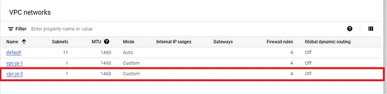
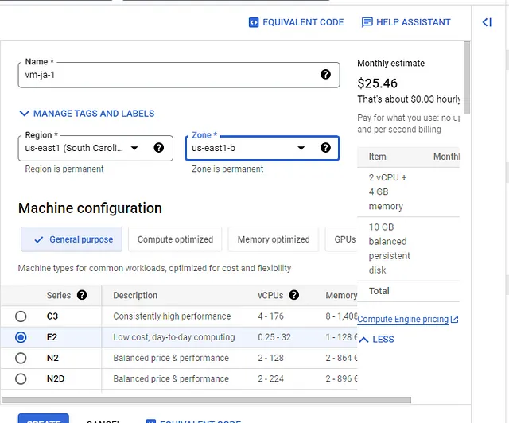

# Create two VMs that reside under two different VPCs located in different geographical regions. Spin up an nginx server on one VM and try to connect to it from the other VM.


## Introduction:

In this hands on demo project we will create two vpc in GCP and under the vpc we will create two vm(virtual machine). We will install nginx server in one vm and will try to connect it from the other vm.
## What is VM?

VM stands for Virtual Machine. It is a software emulation of a physical computer that runs an operating system and applications as if it were a separate physical machine. Virtual machines are created by virtualization software that allows multiple virtual machines to run on a single physical host machine.

Popular virtualization solutions include VMware vSphere, Microsoft Hyper-V, Oracle VirtualBox, and open-source solutions like KVM (Kernel-based Virtual Machine) and Xen.
## What is VPC?

VPC stands for Virtual Private Cloud. It is a cloud computing concept and service offered by various cloud providers like Amazon Web Services (AWS), Microsoft Azure, Google Cloud Platform (GCP), and others. A VPC allows users to create a virtual network in the cloud, which simulates the functionalities of a traditional on-premises network within a cloud environment.

It’s important to note that the specifics of a VPC can vary depending on the cloud provider you use. For example, AWS’s VPC might have slightly different features and terminology compared to Azure’s VNet (Virtual Network) or GCP’s VPC. However, the underlying concept of creating a private virtual network within the cloud remains consistent across these providers.
## What is GCP?

GCP stands for Google Cloud Platform. It is a suite of cloud computing services and products offered by Google. GCP provides a wide range of cloud-based solutions that enable businesses and developers to build, deploy, and scale applications and services effectively. As with other major cloud providers like Amazon Web Services (AWS) and Microsoft Azure, GCP offers various services across multiple domains, including computing, storage, databases, machine learning, networking, and more.
## What is Nginx?

Nginx (pronounced “engine-x”) is a high-performance, open-source web server and reverse proxy server. Originally developed by Igor Sysoev in 2004, Nginx is now maintained and developed by Nginx, Inc. It is one of the most popular web servers in the world and is widely used for serving web content, handling application delivery, and acting as a reverse proxy for load balancing and caching.

Nginx is widely used by many high-traffic websites, web applications, and content delivery networks (CDNs) due to its efficiency, speed, and ability to handle heavy workloads. It is often deployed in combination with other technologies like PHP, Node.js, Ruby, and others to create powerful and scalable web architectures.

In addition to the open-source version, Nginx, Inc. offers commercial products and services, including Nginx Plus, which provides additional features and support for enterprise use cases.
## Overview of the full diagram below:


## Prerequisite:

- You will need GCP account
- Knowledge about VM instance, Subnetting, Network interface.
## Step 1:

In this step we will create two VPC in two different region and give them an ip range.

First login into GCP. You will see dashboard like this


Now, go to vpc nerwork option from left side and click on vpc network.


Now click on create VPC Network(see the highlighted area).


## 1st VPC

Now we will create our first vpc. Give a vpc name(give name as your wish).


Now scroll and go to the new subnet option, give a name for subnet(subnet-ja-1), select a region(us-east-1) and add ip range(i have given 10.10.0.0/24).


Now, go to firewall option and select all firewall option. Remember this is just a hands on demo project that’s why we have selected all firewall option, you will not try this in production project.


Now scroll down and click create button to create our fisrt vpc.


Now see the vpc network chart, our first vpc(vpc-ja-1) is listed there.


## 2nd VPC

We will do the same task to create our second vpc(vpc-ja-2)

Again click on create vpc network. Give a vpc name(give name as your wish).


Now scroll and go to the new subnet option, give a name for subnet(subnet-ja-2), select a region(us-west-1) and add ip range(i have given 192.168.0.0/24).


Now, go to firewall option and select all firewall option. Remember this is just a hands on demo project that’s why we have selected all firewall option, you will not try this in production project.


Now scroll down and click create button to create our second vpc.


Now see the vpc network chart, our first vpc(vpc-ja-1) is listed there.




## Step 2:

In this step we will create create two vm under this two vpc.

Go to left hand menu. From Compute Engine click on vm instance option.


Now click on create instance(see the highlighted area).


## 1st VM:

Now we will create our first vm. Give a name to vm(give name as your wish), select a region(as we are creating this vm under our 1st vpc. First vpc is in the us-east1 region, so we will select us-east1 region), select zone(this is availability zone, i have selected use-east1-b, you can choose your own), select machine configuration(i have choosen E2, as it is low configuration and low cost, it’s a just hand’s on demo, so we don’t need any high configuration).



Now, scroll down below to Firewall option and choose Allow HTTP traffic and Allow HTTPS traffic both options.


Now go to Advance options, click on Networking option.


Now go to network interface option select network(we will select vpc-ja-1), select subnetwork(i have selected subnet-ja-1).


Now, scroll below and click on create button.


Our first vm is created. See the figure below.


Our 1st vm got the internet ip(private ip) of 10.10.0.2 and if you scroll to right you will see an external ip(public ip) of 34.23.174.27


## 2nd VM:

Now again click on create instance option.

Now we will create our second vm. Give a name to vm(give name as your wish), select a region(as we are creating this vm under our 2nd vpc. Second vpc is in the us-west1 region, so we will select us-west1 region), select zone(this is availability zone, i have selected use-west1-b, you can choose your own), select machine configuration(i have choosen E2, as it is low configuration and low cost, it’s a just hand’s on demo, so we don’t need any high configuration).

Now, scroll down below to Firewall option and choose Allow HTTP traffic and Allow HTTPS traffic both options.

Now go to Advance options, click on Networking option.

Now go to network interface option select network(we will select vpc-ja-2), select subnetwork(i have selected subnet-ja-2).

Now, scroll below and click on create button.

Our second vm(vm-ja-2) is created. See the figure below.

Our 1st vm got the internet ip(private ip) of 192.168.0.2 and if you scroll to right you will see an external ip(public ip) of 34.168.99.60

Now, we successfully created our vm under the vpc. we will test the ping comand from one vm to another vm.

Now we will access the terminal of vm-ja-1. For that click on SSH of vm-ja-1. Enable pop-up and authorize.

We, have successfully opened our vm-ja-1 terminal. Remember our first vm’s(vm-ja-1) ip is 10.0.0.2 and second vm’s(vm-ja-2) ip is 192.168.0.2

Now, from 1st vm’s terminal type this command.

```ruby
ping 192.168.0.2 -c 5
```

you will get output like this.

So, we are not getting ping response. Because this two vm is not connected. So, we will connect this two vm using vpc peering.


## Step 3:

In this step we will peer two vpc. From left hand menu vpc network click on vpc network peering.

Now click on create connection

Click on continue button


## Peering from vpc-ja-1 to vpc-ja-2:

We are peering from vpc-ja-1 to vpc-ja-2. Give a name of the peering(i have given from-vpc-ja-1-to-vpc-ja-2), select you vpc, select peered vpc network.

Now click on create button.

Now, we have successfully created our first peering.

Look at the status filed. It’s showing inactive. Because we have just peered from vpc-ja-1. We need to do this peering from vpc-ja-2 also. Then this peering will work.


## Peering from vpc-ja-2 to vpc-ja-1:

Now click on create peering connection.

Click on continue button

We are peering from vpc-ja-2 to vpc-ja-1. Give a name of the peering(i have given from-vpc-ja-2-to-vpc-ja-1), select you vpc, select peered vpc network.

Now click on create button.

So we have successfully created second peering from vpc-ja-2

Look status field now, it’s showing active now.
## Step 4:

In this step we will test the ping command from one vm to another whether it’s connected through vpc peering or not.
## # Ping from vm-ja-1 to vm-ja-2

From left hand menu compute engine click on vpc instance.

you will thed vm’s list. Open the SSH terminal of vm-ja-1

Now, type this command

```ruby
ping 192.168.0.2 -c 5
```

you will get ouput like this

so, we have successfully ping the vm-ja-2 from vm-ja-1.


## # Ping from vm-ja-2 to vm-ja-1

Open the SSH terminal of vm-ja-2

Now, type this command

```ruby
ping 192.168.0.2 -c 5
```

you will get ouput like this

so, we have successfully ping the vm-ja-1 from vm-ja-2.


## Step 5:

In this step we will install nginx in one of our vm. we will install nginx in our 1st vm(vm-ja-1). We first update our linux system in both vm. Please open SSH terminal of vm-ja-1 and vm-ja-2 and type this command.

```ruby
sudo apt update -y
```

Now install nginx in vm-ja-1

```ruby
sudo install nginx -y
```

check if nginx is running or not

Type this command

```ruby
sudo lsof -i TCP:80
```

So, nginx is running. Now if we try to hit public ip of vm-ja-1 from the SSH terminal of vm-ja-2 we will get response from nginx server. Type this command from vm-ja-2 SSH terminal

```ruby
curl http://34.148.88.62
```

You will get output like this

It’s a html page.

You can test it from your web browser also. Just type the public ip and hit Enter button

Finally we have done our hands on demo successfully.
